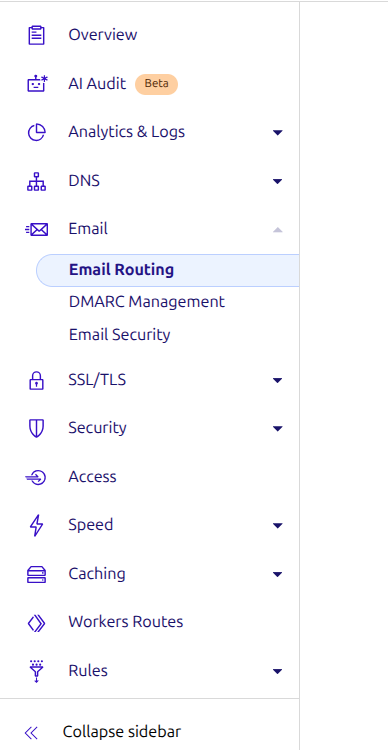
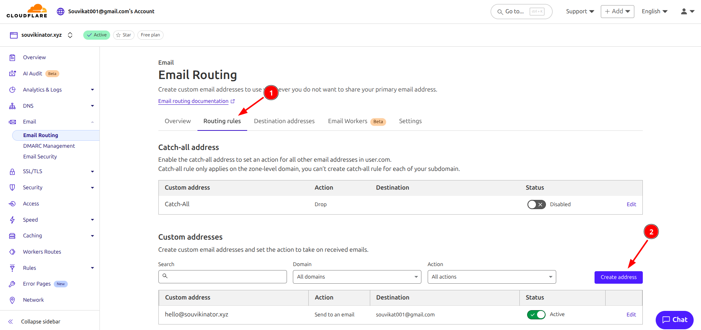
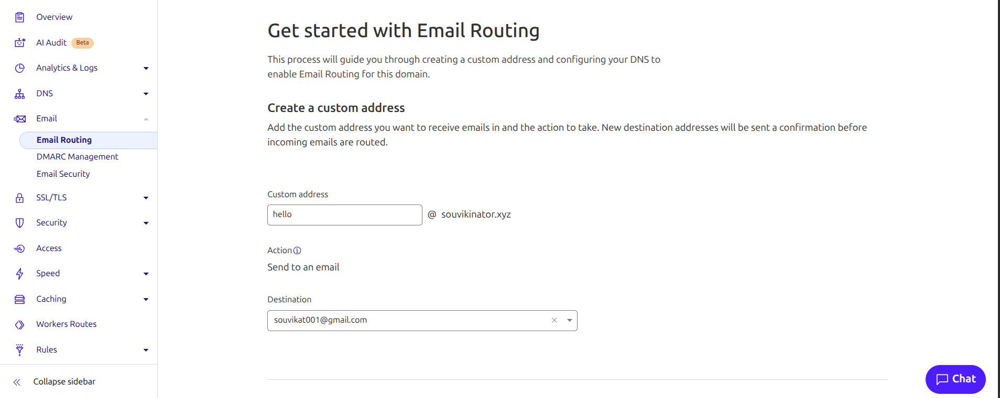
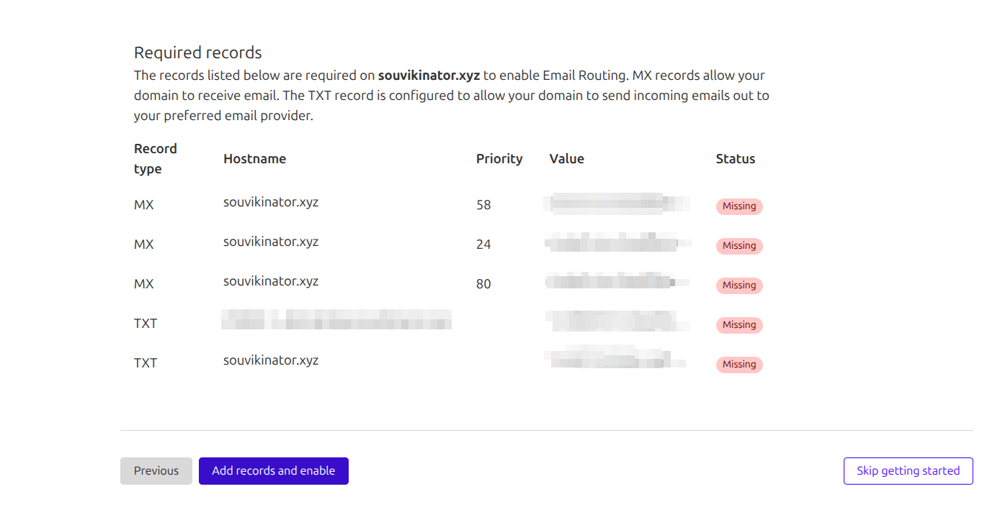
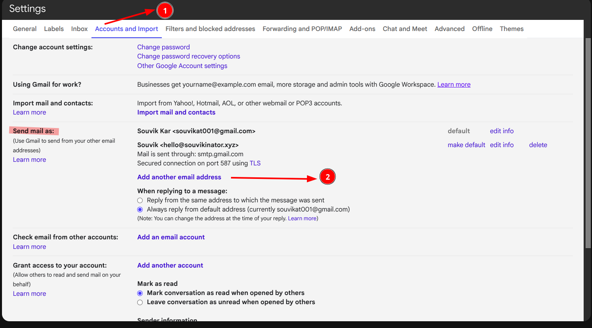
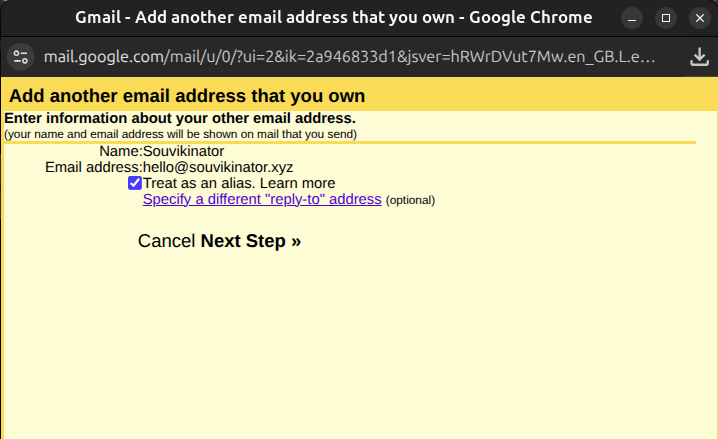
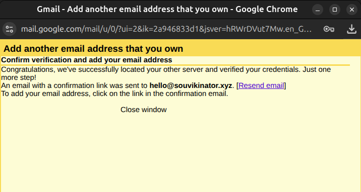
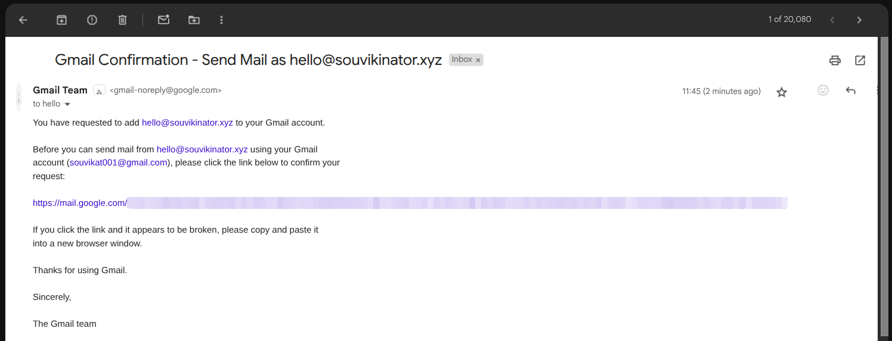
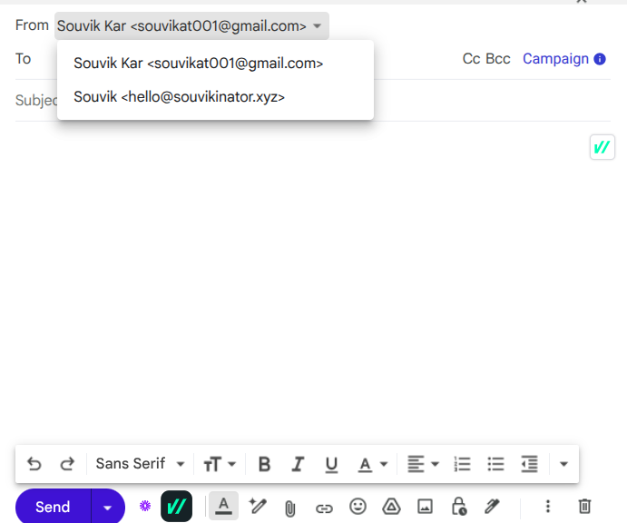
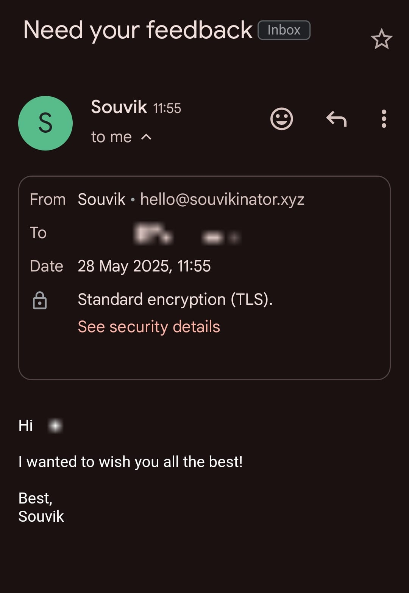

import Callout from '@/components/Callout.astro'

You can get a free email with your domain, and it’s amazing (Thanks, Cloudflare + Gmail).

I used to think that having an email like `name@jhadoopocha.com` required paying Google, Zoho, or some sketchy hosting provider. But while setting up email subscriptions for this blog (bottom right, go ahead and subscribe 😃), I discovered that Cloudflare lets you do it for free. Even better, you can make those emails land directly in your regular Gmail inbox. One inbox to rule them all. 🔥

I was literally paying for two Google Workspace accounts before this. TWO. Now, I’m saving money and still getting the same functionality.

This guide will show you how to use Cloudflare’s free email routing feature to set up a custom email address for your domain and forward those emails to your Gmail account. You’ll be able to send and receive emails from your custom domain without spending a dime.

## Why You Need a Custom Email

Having a cool domain for your product or website is great, but if your support email is something like `coolstartuphelp@gmail.com`, you’re leaking credibility faster than a bucket with no bottom.

Using a custom email like `help@coolstartup.com` is worth the 5-minute setup:

- **Professionalism**: It looks more legit and trustworthy.
- **Branding**: It reinforces your brand every time you send an email.
- **Control**: You own the domain, so you control the email addresses.
- **Deliverability**: Custom domain emails (if set up right) often have better deliverability and are less likely to go to spam.
- **Scalability**: You can create `team@`, `support@`, etc., without juggling multiple Google accounts.

Even if you’re a solo developer, having a custom email makes you look more serious about your work. It’s like wearing a suit to a meeting instead of pajamas.

## Before You Start

To use Email Routing, your domain’s DNS must be managed by Cloudflare. If it isn’t, this won’t work.

Let’s begin the setup, assuming you already have your domain set up with Cloudflare. If not, start by [adding your domain to Cloudflare](https://developers.cloudflare.com/fundamentals/setup/manage-domains/add-site/).

## Set Up Email Routing in Cloudflare

1. Go to your [Cloudflare dashboard](https://dash.cloudflare.com/), where you’ll see your domains listed.
2. Select your domain from the list.
3. In the left sidebar, navigate to **Email** > **Routing**.
   
4. Click **Get Started** if you’re starting fresh. Otherwise, go to routing rules and click **Create Address**.
   
5. Add your custom email address in the **Email Address** field, select **Send to Email** as the action, and set the destination to your primary Gmail address:
   
6. Cloudflare will prompt you to add some DNS records to verify your domain and set up email routing. Click **Add records and enable** to proceed.
   

That’s it for the Cloudflare setup. Now, let’s configure Gmail to send and receive emails from this custom address.

## Configure Gmail to Send/Receive Emails

1. Open Gmail and go to **Settings** (gear icon in the top right corner), then click **See all settings**.
2. Navigate to the **Accounts and Import** tab > **Send mail as** > **Add another email address**.
   
3. In the pop-up, enter your custom email address and the name you want to associate with it.
   
4. Click **Next**. Use the following SMTP settings:
   - SMTP Server: `smtp.gmail.com`
   - Port: `587`
   - Username: Your primary Gmail address.
   - Password: Your App Password (if 2FA is enabled).
   - Check **Secured connection using TLS**.

<Callout variant="note">
  The password is your Google App Password (not your Gmail password). Create one [here](https://myaccount.google.com/apppasswords). Ensure 2FA is enabled on your Google account.

Detailed guide: [Creating Google App Passwords](https://docs.saleshandy.com/en/articles/10182595-how-to-set-up-an-app-password-in-google).

</Callout>

If you follow the above steps correctly, Gmail will send a verification email to your custom email address. Since we’ve set up email routing in Cloudflare, this email will be forwarded to your primary Gmail inbox.

In my case, they’ll send it to `hello@souvikinator.com`, but since we configured it to forward to my primary Gmail, it’ll show up in my personal email `souvikat001@gmail.com`. If you look closely, the receiving email is the custom one.

## How to Use Custom Email in Gmail

Now that you’ve set up your custom email address, you can use it to send and receive emails directly from your Gmail account.

When composing a new email, you can select your custom email address from the **From** dropdown menu. This way, your recipients will see your custom email address instead of your primary Gmail address.

Here’s a test email to show how it looks when you send an email from your custom email address:

