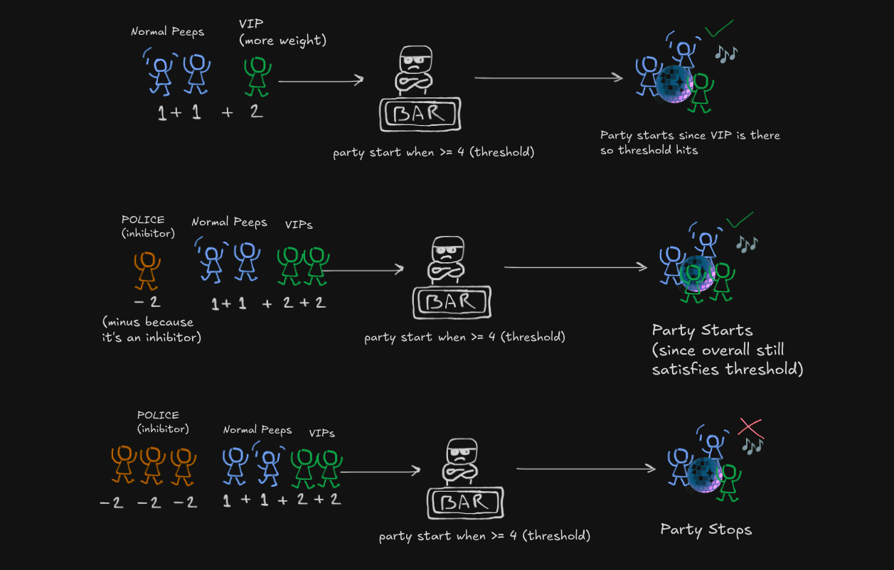

Once upon a time,

**Neuroscientists**: "It’s all about synapses and neurotransmitters.”<br />
**Engineers**: “Cool story. Let's make it run on Python?”

and here we are running LLMs...

I started reading this book "How Machines Learn", and was really fascinated and found myself deep into the rabbit hole. This blog post will explore how these first artificial neuron MCP followed by perceptron were modeled around the actual neuron. The math it uses is also pretty basic but amazing.

## The Real Deal: Biological Neurons

We all know Neurons are cells found in nevrous system and it's main job is to transmit electrical and chemical signals throughout the body.


### How do neurons work?

1. **Dendrites**: these are like thoundands of tiny antennas, each receive signals from other neurons

2. **Signals**: these are electrochemical signals and one thing to note is each signal has it's importance meaning one signal can be less important than other. Signals can be excitatory (encouraging the neuron to fire) or inhibitory (discouraging it)

3. **Cell body/Soma**: All the incoming signals gather up at the body and it decides whether to fire the signal or not. If the combines importance of the excitatory signal minus the inhibitroy signal exceeds this threshold -> Boom the neuron fires.

4. **Axon & Terminals**: This is like a dedicated output cable, carrying the decision. Axon terminals are like broadcast stations, sending the signal to dendrites of other neurons

### Neuron working analogy


Think of it like a bar with the world's most mathematical bouncer. Let's break down how this party (I mean, neuron ;) works:

1. Every person (signal) has a specific importance value (weight)
2. Normal people count as 1
3. VIPs count as 2 (they're twice as important!)
4. Police/party-poopers count as -2 (they actually work against the party starting)
5. The party only starts when the total "party value" hits a certain threshold

#### **The Basic Party Math**


When just one regular person shows up (value = 1), and the threshold is > 1, no party happens. But when two regular people arrive (1 + 1 = 2), boom! We hit the threshold, and the party (neuron) activates!

#### **When Things Get Interesting**



Now this is where our bouncer's math gets spicy (just like real-world drama):

**Scene 1**: Two regular college buddies show up $(1 + 1)$, but wait... who's that rolling up in a Mercedes? Oh snap, it's the minister's son and his influencial friend $(VIP = 2)$! Total party value hits $6$ and Party mode: ACTIVATED! 🎉

**Scene 2**: A police officer $(-2)$ shows up after getting noise complaints. But lucky for us, we've got our the minister's son and his equally influential friend $(2 + 2)$.
Even with Officer Party-Pooper, the vibe stays alive because $4 > threshold$.

Diplomatic immunity for the win! (He pulled off an _'Janta hai mera baap kon hai?'_)

**Scene 3**: Plot twist! Turns out he was just pretending to be a minister's son.

Three real police officers $(-2 × 3 = -6)$. Even with our regular squad and the influential friend $(total positive = 6)$, the party gets shut down faster than he can say "My dad will hear about this!" Because $6 - 6 = 0 < 4$

Moral of the story? Just like neurons, it's all about balance - and maybe don't lie about being a minister's kid! 😅

Just like this bouncer, a neuron:

- Adds up excitatory signals (party people)
- Subtracts inhibitory signals (police)
- Only "fires" (starts the party) when the total hits the threshold
- Stays quiet (no party) when it doesn't

Well guys that's what McCulloch Pitts Neuron (MCP) Neuron is really

## McCulloch Pitts Neuron (MCP)


Here is how it works:

1. Takes weighted inputs and sums them up
2. Passes weighted sum to the **activation function**
3. Activation function based on threshold produces binary output $1$ or $0$

> Why binary output?
>
> Because back then due to limited understanding of neurons, scientists were under the assumption that neurons were in two state: **Fires** or **Doesn't fire**.
>
> Now we know that Neurons produces spectrum of outputs and there are a lot more elements involved into it and we have more advanced models of neurons.

### Activation function

An activation function is like a decision-maker for a neuron, like the Soma (cell body).

It takes total signal a neuron receives (after adding all of the weighted inputs) and determines what the output should be, which is usually transformed into something useful like 0 or 1, or a number between 0 and 1.

The MCP neuron uses **Step Function** i.e it returns binary output based on the input meeting the given a threshold $θ(theta)$ criteria.

$y$ being the output of the activation function and $u$ being input (total signal/weighted sum)

```math
{\displaystyle y={\begin{cases}1&{\text{if }}u\geq \theta \\0&{\text{if }}u<\theta \end{cases}}}
```

and if get anxious see such mathy fonts here is flow diagram:


This is also used in [perceptron](#perceptron) as we'll discuss further. But the question is what can we do with it?

### Logic Gates using MCP

What??

## Perceptron

How Rosenblatt took the MCP neuron and said "but what if it could learn?"
The learning algorithm (but make it relatable)
Use an analogy like teaching a stubborn friend - it keeps making mistakes but eventually gets it

## Limitations and Differences

Limitations (the XOR problem - when our simple friend got humbled)
How these limitations led to deeper networks
Wrapping Up
Connect back to how this simple model, despite its limitations, launched the entire field of neural networks
End with a forward-looking statement about where this is heading
