import Callout from '@/components/Callout.astro'
import { Video } from '@/components/ui/video'
import weightChangeVideo from './mcp-weight-change.mp4'
import biasShiftVideo from './perceptron-plot-bias.mp4'


I recently picked up "How Machines Learn" by [Anil Ananthswamy](https://anilananthaswamy.com/) (gifted by my gf) and was blown away by how it traces the roots of artificial intelligence back to the earliest models of artificial neurons which were inspired by the very cells firing in your brain right now. 

In this post, we’ll build an intuition on how these foundational models were devised, break down the maths behind it in a simple and visual way, and see just how closely they mirror real neurons. Plus, there might be a meme or two to keep things lively. It's going to be a long read ;)

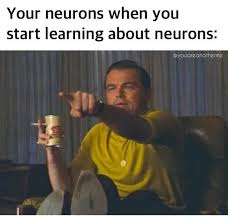

## The Real Deal: Biological Neurons

We all know Neurons are cells found in Nervous system and it's main job is to transmit electrical and chemical signals throughout the body.

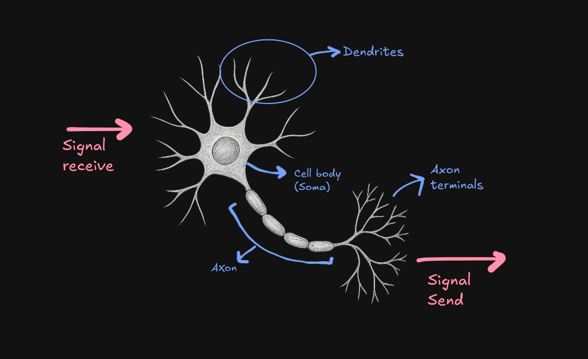

### How do neurons work?

1. **Dendrites**: these are like thoundands of tiny antennas, each receive signals from other neurons

2. **Signals**: these are electrochemical signals and one thing to note is each signal has it's importance meaning one signal can be less important than other. Signals can be excitatory (encouraging the neuron to fire) or inhibitory (discouraging it)

3. **Cell body/Soma**: All the incoming signals gather up at the body and it decides whether to fire the signal or not. If the combines importance of the excitatory signal minus the inhibitroy signal exceeds this threshold -> Boom the neuron fires.

4. **Axon & Terminals**: This is like a dedicated output cable, carrying the decision. Axon terminals are like broadcast stations, sending the signal to dendrites of other neurons

### Neuron working analogy

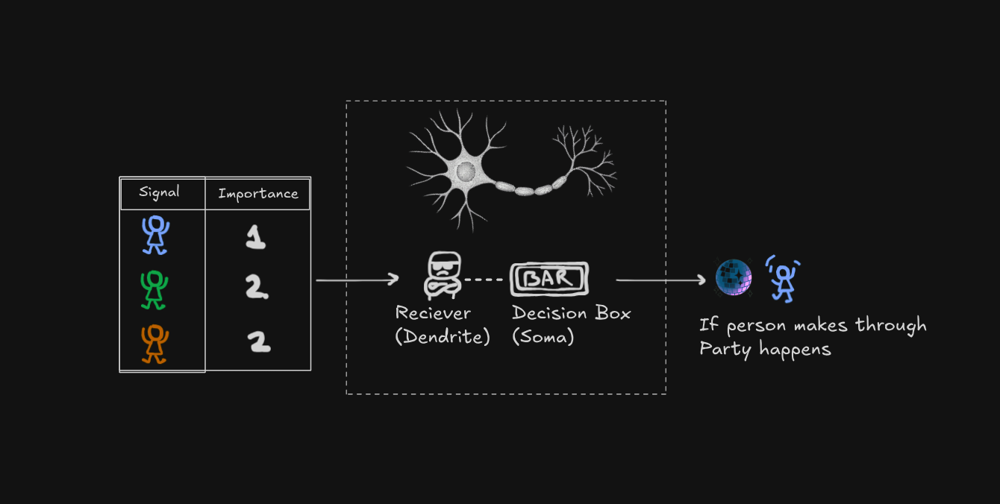

Think of it like a bar with the world's most mathematical bouncer. Let's break down how this party (I mean, neuron ;) works:

1. Every person (signal) has a specific importance value (weight)
2. Normal people count as 1
3. VIPs count as 2 (they're twice as important!)
4. Police/party-poopers count as -2 (they actually work against the party starting)
5. The party only starts when the total "party value" hits a certain threshold

#### **The Basic Party Math**

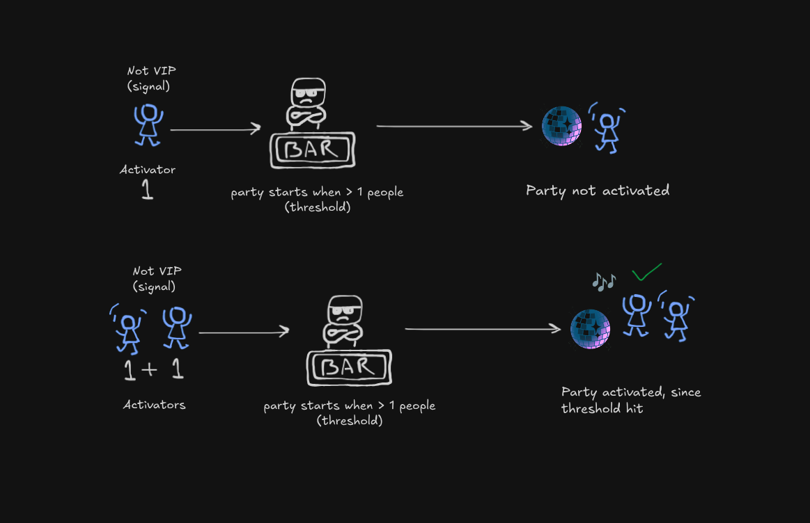

When just one regular person shows up (value = 1), and the threshold is > 1, no party happens. But when two regular people arrive (1 + 1 = 2), boom! We hit the threshold, and the party (neuron) activates!

#### **When Things Get Interesting**

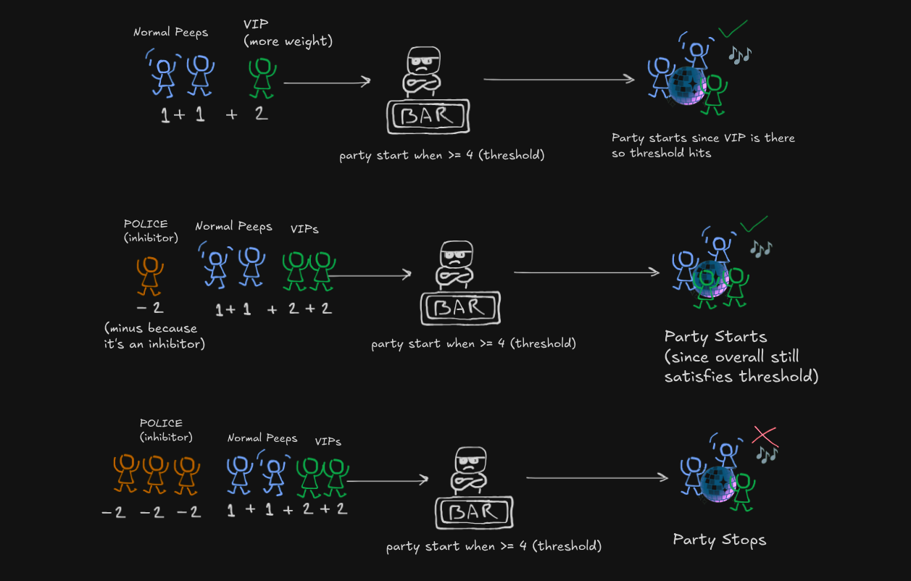

Now this is where our bouncer's math gets spicy (just like real-world drama):

**Scene 1**: Two regular college buddies show up $(1 + 1)$, but wait... who's that rolling up in a Mercedes? Oh snap, it's the minister's son and his influencial friend $(VIP = 2)$! Total party value hits $6$ and Party mode: ACTIVATED! 🎉

**Scene 2**: A police officer $(-2)$ shows up after getting noise complaints. But lucky for us, we've got our the minister's son and his equally influential friend $(2 + 2)$.
Even with Officer Party-Pooper, the vibe stays alive because $4 > threshold$.

Diplomatic immunity for the win! ('Janta hai mera baap kon hai?'_)

**Scene 3**: Plot twist! Turns out he was just pretending to be a minister's son.

Three real police officers $(-2 × 3 = -6)$. Even with our regular squad and the influential friend $(total positive = 6)$, the party gets shut down faster than he can say "My dad will hear about this!" Because $6 - 6 = 0 < 4$

Moral of the story? Just like neurons, it's all about balance - and maybe don't lie about being a minister's kid! 😅

Just like this bouncer, a neuron:

- Adds up excitatory signals (party people)
- Subtracts inhibitory signals (police)
- Only "fires" (starts the party) when the total hits the threshold
- Stays quiet (no party) when it doesn't

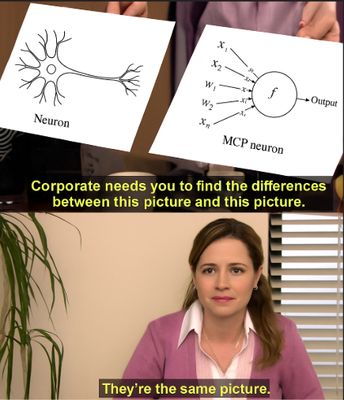

Well that's what McCulloch Pitts Neuron (MCP) Neuron does. It's a super simplified binary version of a real neuron.

### Threshold for biological neurons

**You must be wondering who set's biological neuron's threshold? **

In biological neurons, the "threshold" is called **Action Potential** and it's determined by the neuron's properties and the environment.

The threshold can change based on chemicals in the brain, fatigue, or recent activity (for example, after firing a lot, a neuron might temporarily raise its threshold to avoid overloading).

So, in the brain, the threshold is a dynamic property, influenced by genetics, experience, and the neuron's current state.

## McCulloch Pitts Neuron (MCP)

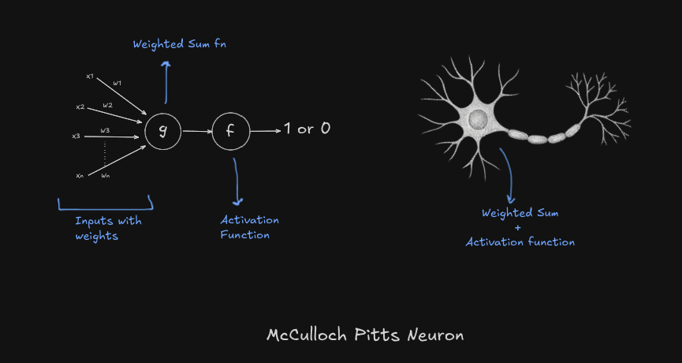

Here is how it works:

1. Takes weighted inputs and sums them up
2. Passes weighted sum to the **activation function**
3. Activation function based on threshold produces binary output $1$ or $0$

<Callout variant="explanation" title="Why binary output?">

**Why binary output?**

Because back then due to limited understanding of neurons, scientists were under the assumption that neurons had two state: **Fires** or **Doesn't fire**.

Now we know that Neurons produces spectrum of outputs and there are a lot more elements involved into it and we have more advanced models to memic that.
</Callout>

### Activation function

An activation function is like a decision-maker for a neuron, like the Soma (cell body).

It takes total signal a neuron receives (after adding all of the weighted inputs) and determines what the output should be, which is usually transformed into something useful like 0 or 1, or a number between 0 and 1.

The MCP neuron uses **Step Function** i.e it returns binary output based on the input meeting the given a threshold $θ(theta)$ criteria.

$y$ being the output of the activation function and $u$ being input (total signal/weighted sum) or in other terms $u$ is the output of the weighted sum function.

```math
{\displaystyle y={\begin{cases}1&{\text{if }}u\geq \theta \\0&{\text{if }}u<\theta \end{cases}}}
```

<Callout title="Intuition" variant="intuition">
  <p>
    If you get anxious seeing such mathy fonts, here's a flow diagram to help build intuition:
  </p>

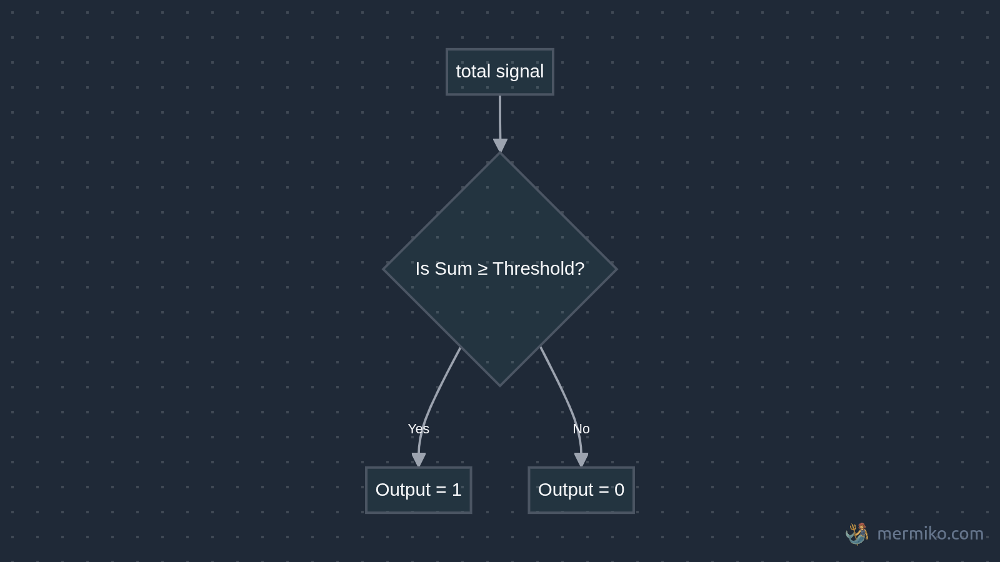

</Callout>

This is also used in [perceptron](#perceptron) as we'll discuss further. But the question is what can we do with it?

### Implementing MCP Neuron

Let's implement it in code. We'll use Python to create a simple implementation of the MCP neuron.


<Callout title="Python Implementation: MCP Neuron" variant="example">
  <p>
    This class takes a list of weights and a threshold, computes the weighted sum of the inputs, and applies a step activation function:
  </p>
  ```python showLineNumbers
  class MCPNeuron:
      def __init__(self, weights, theta):
          self.weights = weights
          self.theta = theta

      def weighted_sum(self, inputs):
          return sum(i * w for i, w in zip(inputs, self.weights))

      def step_function(self, u):
          return int(u >= self.theta)  # returns 1 if threshold met, else 0

      def activate(self, inputs):
          u = self.weighted_sum(inputs)
          return self.step_function(u)
  ```
</Callout>


### Implementing Logic Gates using MCP

Why are we suddenly talking about logic gates? Well, it turns out MCP neurons can do something pretty neat: they can simulate basic logical operations. This was one of the first practical applications that got researchers excited.

Just by choosing different weights and thresholds, we can make it perform logical operations. Let's see how:

#### The AND Gate

First, let's look at the AND operation:

| Input 1 | Input 2 | Output |
| ------- | ------- | ------ |
| 0       | 0       | 0      |
| 0       | 1       | 0      |
| 1       | 0       | 0      |
| 1       | 1       | 1      |

To make an MCP neuron behave like an AND gate:

- Give both inputs a weight of 1
- Set threshold to 2
- This way, we only get output 1 when BOTH inputs are 1 (1 + 1 ≥ 2)

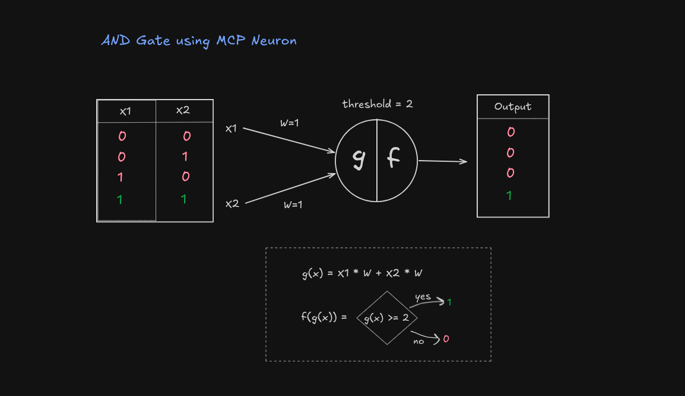

<Callout variant="example" title="Implementing AND Gate">
  <p>
    Here's how we can implement the AND gate using our MCP neuron:
  </p>
  ```python showLineNumbers
weights = [1,1]
threshold = 2
andGate = MCPNeuron(weights,threshold)

inputs = [1,1] # try out other inputs
print(andGate.activate(inputs))
  ```
</Callout>

#### The OR Gate

The OR operation outputs true if ANY input is true:

| Input 1 | Input 2 | Output |
| ------- | ------- | ------ |
| 0       | 0       | 0      |
| 0       | 1       | 1      |
| 1       | 0       | 1      |
| 1       | 1       | 1      |

To create an OR gate:

- Keep weights at 1 each
- Lower threshold to 1
- Now we get output 1 if ANY input is 1 (because 1 ≥ 1)

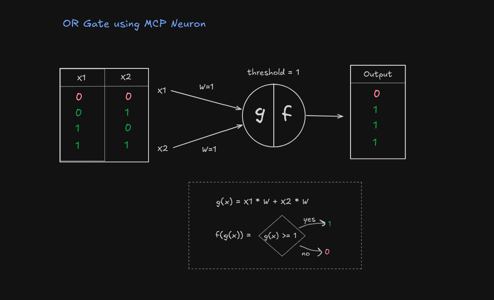

<Callout variant="example" title="Implementing AND Gate">
  <p>
    Here's how we can implement the OR gate using our MCP neuron:
  </p>
  ```python showLineNumbers
weights = [1,1]
threshold = 1
orGate = MCPNeuron(weights,threshold)

inputs = [1,1] # try out other inputs
print(orGate.activate(inputs))
  ```
</Callout>

#### NOT gate (Inhibitor signal)

The NOT gate is particularly interesting because it mirrors how inhibitory signals work in biological neurons. Remember how our bouncer dealt with party-poopers? This is similar!

| Input | Output |
| ----- | ------ |
| 0     | 1      |
| 1     | 0      |

To create a NOT gate using an MCP neuron:

- Give the input a negative weight (-1): 👈 this makes it inhibitory
- Set threshold to 0
- When input is 1: (-1 × 1) = -1 < 0, output 0
- When input is 0: (-1 × 0) = 0 ≥ 0, output 1

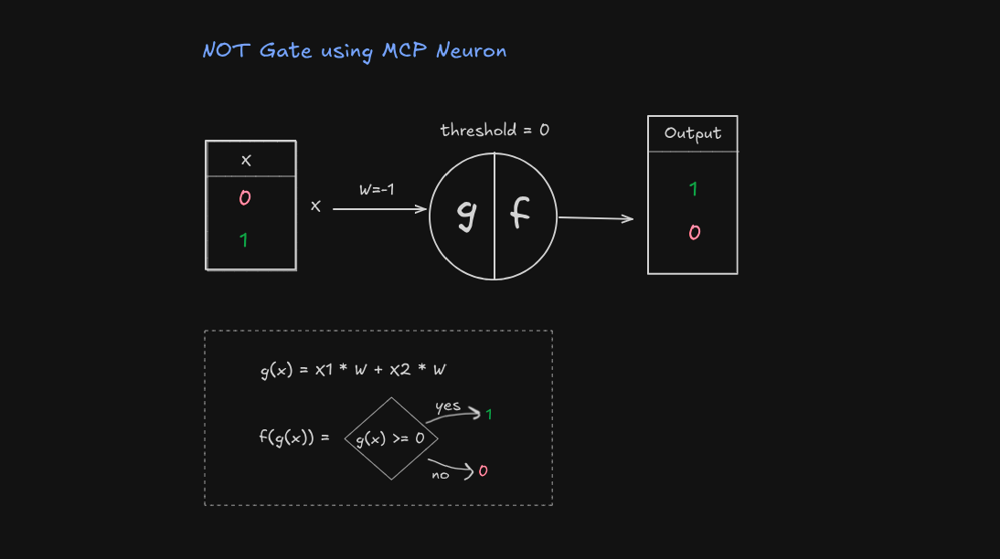

<Callout variant="example" title="Implementing NOT Gate">
  <p>
    Here's how we can implement the NOT gate using our MCP neuron:
  </p>
  ```python showLineNumbers
  weights = [-1]
  threshold = 0
  notGate = MCPNeuron(weights,threshold)

  inputs = [1] # try out other inputs
  print(notGate.activate(inputs))
  ```
</Callout>

<Callout variant="exercise" title="Try it yourself!">
- Try designing other logic gates (like <b>NAND</b>, <b>NOR</b>, <b>XOR</b>) using the MCP neuron model.
- Can you find a gate that <b>cannot</b> be implemented with a single MCP neuron? (Hint: **XOR**)
- Think about <b>why</b> some gates work and others don't, what's special about their logic?
- Try chaining multiple MCP neurons to create more complex logic.
</Callout>


### Linear Separability

<Callout variant="definition" title="Linear Separability">
A problem is said to be **linearly separable** if you can draw a straight line (or hyperplane in higher dimensions) that can separate the data into different classes.

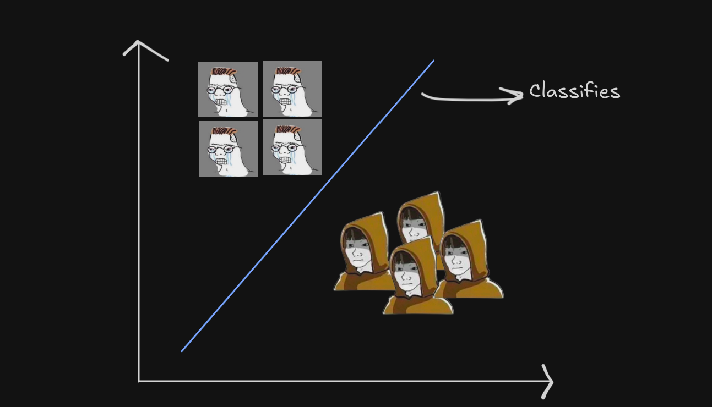
</Callout>

Let's visualize the whole process on a graph. Suppose we have two inputs: **temperature** and **humidity** and we need decide if we go outside (output 1) or stay in (output 0).

To recap, MCP neuron takes these inputs, gives them weights (how important they are), adds them up, and checks against a threshold.

<Callout variant="proof" title="Translating to graph">
Say, weights are 1 for temperature ($t$) and 1 for humidity ($h$), and the threshold ($\theta$) is $2$.

$$
u = w_t \times t + w_h \times h
$$

$$
u = 1 \times t + 1 \times h
$$

$$
u = t + h
$$

What's the minimum condition for the neuron to output 1?

$$
u = t + h = 2
$$

</Callout>

This is the equation of a line! say $t$ as $x$ axis and $h$ as $y$ axis, this is what the graph looks like:

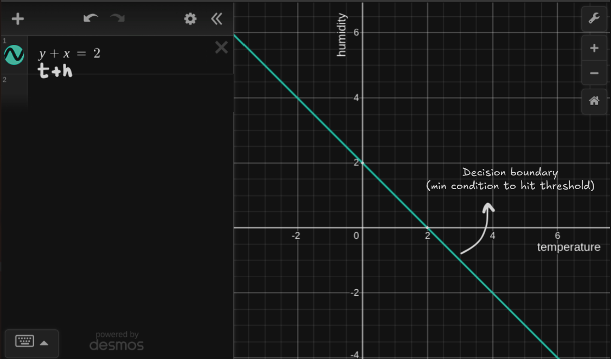

<Callout variant="explanation">
**What does this line signify?**

It's the **decision boundary** or simply put the minimium requirement for neuron to fire/activate. So as per the graph any point on the line i.e $t + h = 2$ will be classified as 1 (go outside) and any point below the line i.e $t + h < 2$ will be classified as 0 (stay in).
</Callout>

but wait we have an inequality to handle:

$$
t + h \geq 2
$$

here is the graph of the inequality:

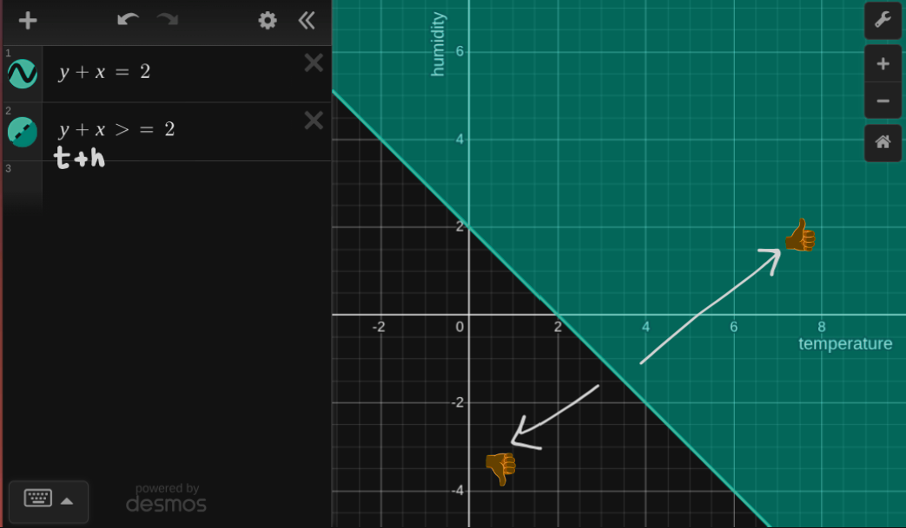

<Callout variant="explanation">
Its whole fucking area now. This means any value of $t+h$ that falls in this area will be classified as 1 (go outside) and value of $t+h$ that falls outside this area will be classified as 0 (stay in).
</Callout>

Now the weights (importance) of the inputs influences whether to go out or not.

say weight of $temperature$ is $0$ and weight of $humidity$ is $1$. This means we don't care about temperature and only care about humidity, so the line will be parallel to $t$ axis and will pass through $h = 2$

Here is a visual of how weights influence the line:

<Video src={weightChangeVideo} />

Alright maybe I played too much there 💀 but you get the point. Go ahead playround with the weights and see how it changes the line: [MCP Neuron plot](https://www.desmos.com/calculator/gcuaqgxule)

### Limitations

Even though the MCP neuron was a breakthrough, it comes with some important limitations:

- **No learning or adaptation:** The weights and threshold (unlike biological neurons) are fixed and must be set manually, so the neuron can't adjust or improve itself based on experience or new data.
- **Works only with simple, linearly separable problems:** It can only handle binary  signals and can solve logic gates like AND, OR, and NOT, but fails for more complex cases like XOR that can't be separated by a straight line.

This made [Frank Rosenblatt](https://en.wikipedia.org/wiki/Frank_Rosenblatt) think: "How about making the MCP neuron learn?"

## Perceptron

The basic structure is just like the MCP neuron, but here's the big difference: **the weights and threshold can be adjusted through learning!**


### How do biological neurons learn?

> Neurons that fire together, wire together.

Neurons talk to each other through connections called synapses. When two neurons send signals (or "fire") at the same time a lot, their connection gets stronger. When they don’t fire together often, their connection gets weaker. 

<Callout variant="definition" title="Hebbian principle">
This strengthening and weakening is how your brain learns. This is called **Hebbian principle**.
</Callout>

<Callout variant="explanation">
An analogy would be the more you hang out with a friend, the stronger the connection between you two.

When you practice a song on the piano, the neurons involved fire together a lot, and their connections get stronger. That’s why you get better with practice!

If you stop using a skill or forget something, those neuron connections weaken because they’re not being used.
</Callout>

While the main idea is about making connections stronger or weaker, a lot more complex stuff happens in the brain:

- Add more "receivers" (receptors) at a synapse to catch signals better.
- Change how many chemical messengers (neurotransmitters) are sent between neurons.
- Even grow new synapses or get rid of old ones

### Deriving Perceptron from MCP Neuron (mathematically)

It'll get a bit mathy here, but I promise it'll be worth it. So we want our neuron to fulfill following conditions:

1. Adjust threshold based on learning (unlike MCP neuron, where threshold and weights are fixed)
2. Adjust weights based on learning

Let's break this down step by step.

#### Step 1: Starting with the MCP Neuron

<Callout variant="proof" title="The Basic MCP Model">
First, let's recall how the MCP neuron works. It has two main components:

1. **Weighted Sum**:
$$
u = \sum_{i=1}^{n} w_i x_i
$$

2. **Activation Function**:
$$
y = \begin{cases} 
  1 & \text{if } u \geq \theta \\
  0 & \text{if } u < \theta
\end{cases}
$$

This model works, but the threshold $\theta$ is fixed. We need to make it learnable.
</Callout>

#### Step 2: Making the Threshold Learnable

<Callout variant="proof" title="Transforming the Threshold">
Let's transform the fixed threshold into something we can learn:

1. First, write out the activation condition:
$$
\sum_{i=1}^{n} w_i x_i \geq \theta
$$

2. Rearrange by subtracting $\theta$ from both sides:
$$
\sum_{i=1}^{n} w_i x_i - \theta \geq 0
$$

3. Here's the key insight: Let's define $b = -\theta$ and call it the **bias**:
$$
\sum_{i=1}^{n} w_i x_i + b \geq 0
$$

This can also be written as:
$$
x_0 b + \sum_{i=1}^{n} w_i x_i \geq 0
$$

where $x_0 = 1$ is a constant input representing the bias. So we are treating it a combination of weight and input.

</Callout>

Now instead of a fixed threshold $\theta$, we have a bias term $b$ as weight that can can be updated based on learning. This is how the perceptron model looks like so far:

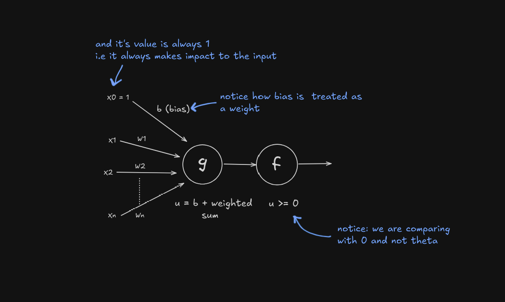


#### Step 3: Learning Rule

  By learning we mean, learning by trial and error:

  1. The perceptron makes a prediction based on its current weights
  2. It compares its prediction with the correct answer
  3. If there's an error, it adjusts its weights slightly in the direction that would reduce the error
  4. This process repeats with many examples until the perceptron achieves good accuracy

  Example:
  - For 5+5 if perceptron predicts 9 and correct answer is 10, it will calculate the error and adjust weights to improve next time until it gets the answer right.

  This iterative process of prediction → error calculation → weight adjustment is what we mean by "learning" and this is what training a perceptron means. It gradually discovers the optimal weights through experience, rather than having them pre-programmed.

<Callout variant="definition" title="The Learning Algorithm">
Now that even bias is a weight, we only need to adjust the weights based on learning.

We'll use the **perceptron learning rule**:

$$
wᵢ ← wᵢ + \underbrace{\eta}_{\text{learning rate}} \times \underbrace{(y – y')}_{\substack{\text{how wrong}\\\text{we were}}} \times \underbrace{xᵢ}_{\substack{\text{did input}\\\text{participate?}}}
$$

  <Callout variant="explanation" title="What does this mean?">
    In simple terms:
  
  $new\_weight = \underbrace{old\_weight}_{w_i} + \underbrace{learning\_rate}_{\eta} \times \underbrace{(correct\_answer - prediction)}_{(y - y')} \times \underbrace{input}_{x_i}$
  
  - $wᵢ$ is the weight of the $i$th input
  - $\eta$ is the learning rate
  - $y$ is the predicted output
  - $y'$ is the correct output
  - $xᵢ$ is the $i$th input
  </Callout>
</Callout>

#### **What's Learning Rate ($\eta$)?**

Think of it like a tap that controls how fast we adjust the weights:
  
- If learning rate is too high (tap fully open): We make big adjustments and might overshoot the correct weights, like flooding a sink or destroying a settlement if it's a dam 💀
- If learning rate is too low (tap barely open): Learning happens very slowly, like filling a swimming pool drop by drop
- Just right (tap opened moderately): We learn steadily without overshooting

For most simple perceptron tasks, a learning rate between 0.1 and 0.01 works well. This gives us enough movement to learn while maintaining stability.

| Learning Rate | Description | Training Behavior |
|--------------|-------------|-------------------|
| 1.0 | High | Quick learning but might overshoot |
| 0.1 | Moderate | Good balance of speed and stability |
| 0.01 | Low | Stable but slow learning |


#### **Why multiply by input ($x_i$)?**

This ensures we only adjust weights that actually contributed to the mistake:
  
  Imagine you're building a dam and notice water leaking. You only want to reinforce the parts where water is actually flowing (input = 1), not the dry parts (input = 0).
  
  - If input was 0: That input didn't contribute to the mistake, so $0 \times anything = 0$ (no adjustment)
  - If input was 1: That input did contribute, so we adjust its weight based on how wrong we were

Idk why I'm obsessed with dams, but it's a good way to think about it.

<Callout variant="note">
If you notice, since bias has a constant input of $1$, it's weight ($bias$) is updated everytime since it's input is always contributing to the output.
</Callout>

Now let's see what the perceptron model looks like now:

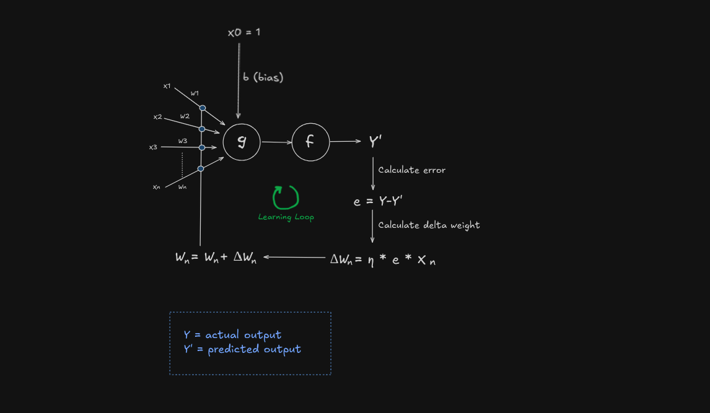

### Iterations, Epochs, and Convergence

Training a perceptron is a bit like practicing a new skill: you rarely get everything perfect on your first try. When training, the perceptron goes through the entire dataset, making predictions and adjusting its weights whenever it makes a mistake. 

<Callout variant="definition" title="Iteration">
This process of looking at one example and possibly updating the weights is called an **iteration**.
</Callout>

<Callout variant="definition" title="Epoch">
When the perceptron has seen every example in the training set once, that's called an **epoch**.
</Callout>

**But why do we need multiple **epoch** / passes through the data?**

Remember [learning rate](#whats-learning-rate-eta)? Well usually a small learning rate is used for a stable learning. This means that the perceptron will make small changes to its weights each time it makes a mistake at each example. 

By going through the data multiple times, the perceptron can slowly and steadily improve, fixing mistakes it couldn't fix in just one round.

<Callout variant="definition" title="Convergence">
**Convergence** happens when the perceptron can go through the entire training set during an epoch without making any mistakes given that the data is [linearly separable](#linear-separability). At this point, it has found a set of weights that correctly classifies all the training data.

Proving this is a bit out of scope of this post, but you can read more about it in this [medium post](https://medium.com/@adnanemajdoub/perceptron-convergence-theorem-c5b44cc06a08).
</Callout>

In summary:
- An **iteration** is one update after seeing a single example.
- An **epoch** is one full pass through all the training data.
- **Convergence** is when the perceptron stops making mistakes on the training set.

#### Why need epochs if model will converge at some point?

You might think:

<Callout variant="problem">

why we use epochs if the model will eventually converge, couldn't we just run it until it reaches that point? 

</Callout>

While this idea makes sense in theory, there are several practical reasons why we rely on epochs.

1. **Computational Efficiency**: Running the model until convergence would be very slow, especially for large datasets. If convergence is slow or if noise in the data prevents the loss from fully stabilizing. By setting a number of epochs, we impose a manageable boundary on resource use. Also allow us to stop early if the model is performing well.

2. **Preventing Overfitting**: If a model runs for too long, it risks overfitting, where it learns not just the general patterns in the training data but also its noise and quirks. This reduces its ability to perform well on new, unseen data. Limiting the number of epochs helps stop training before overfitting becomes a problem.

3. **Monitoring and Validation**: Epochs give us regular checkpoints to assess the model's performance. After each epoch, we can evaluate the model on a separate validation set. This allows us to stop early, halting training if the validation loss starts to rise (a sign of overfitting).

The number of epochs is a tunable. By experimenting with different values, we can determine the optimal number of passes through the data that maximizes performance on a validation set.


### Linear Separability

Just like the MCP neuron, the perceptron can only solve problems that are linearly separable. 

#### How Is It Different from the MCP Neuron?

The perceptron has a superpower: it can learn its weights and threshold($bias$) through training. The MCP neuron, on the other hand, has fixed weights and a threshold set by hand, like a bouncer with a strict guest list that never changes.

#### Visualizing the Decision Boundary

Taking the same example of temperature ($t$) and humidity ($h$). The perceptron computes a weighted sum plus a bias.

<Callout variant="example" title="Perceptron equation">
Starting with the perceptron equation:
$$
u = \sum_{i=1}^{n} w_i x_i + b
$$

we can simplify it for our example:

$$
u = w_tt + w_hh + b
$$

setting $w_t = 1$ and $w_h = 1$ and $b = -2$ we get:

$$
u = t + h + b
$$


The decision is made when:

$$
u = t + h + b \geq 0
$$

the [decision boundary](#linear-separability) is:

$$
t + h + b = 0
$$
</Callout>

Plotting this on the graph we get:

<Video src={biasShiftVideo} />

We have a extra term $b$ which allows us to shift the line in 2D space unlike the MCP neuron where we had a fixed threshold. During the training process $bias$ is learned until the model converges.

Adding up the inequality we get:

$$
t + h + b \geq 0
$$

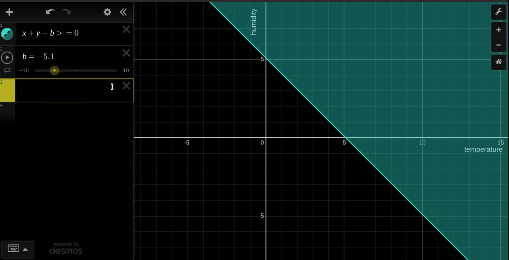

Go ahead and play with the weights and bias to see how it changes the line: [Perceptron plot](https://www.desmos.com/calculator/1qds1k9fe8)

### Implementing Perceptron

Now, let's implement a perceptron in Python.

<Callout variant="example" title="Perceptron class">
```python showLineNumbers
import numpy as np

class Perceptron:
    def __init__(self, learning_rate=0.1, epochs=100):
      self.weights = None
      self.bias = None
      self.learning_rate = learning_rate
      self.epochs = epochs

    def activate(self, x):
      # Step function: output 1 if sum >= 0, else 0
      return 1 if x >= 0 else 0
    
    def weighted_sum(self, x):
      return np.dot(self.weights, x) + self.bias

    def predict(self, x):
      # Weighted sum of inputs + bias
      return self.activate(self.weighted_sum(x))    
```
</Callout>

So far it's same as the MCP neuron with addition of bias and in activation function we are comparing the weighted sum with 0 instead of threshold.

Now we implement the training algorithm, from our understanding so far we need:

- Initialize weights and bias with some random values (preferably small)
- We need to iterate over the whole training data **epochs** times
- Now in each epoch we need to go through each example and check if the prediction is correct
- If prediction is incorrect, we update the weights and bias using the [perceptron learning rule](#step-3-learning-rule)
- We also need to keep track of the number of errors in each epoch and stop if it's 0

<Callout variant="example" title="Training algorithm">
```python showLineNumbers ins={5-23}
import numpy as np

class Perceptron:
    ...
    def train(self, x, y):
      training_data_length = x.shape[1]
      self.weights = np.random.randn(training_data_length) * 0.01
      self.bias = np.random.randn() * 0.01

      for epoch in range(self.epochs):
        total_error = 0
        for i in range(len(x)):
          prediction = self.predict(x[i])
          error = y[i] - prediction
          if error != 0:
              self.weights += self.learning_rate * error * x[i]
              self.bias += self.learning_rate * error #notice
          total_error += abs(error)

        # Stop early if no errors in this epoch
        if total_error == 0:
          print(f"Converged after {epoch+1} epochs")
          break
```
</Callout>

### Learning AND gate

Let's make the perceptron learn the AND gate. The AND gate takes two binary inputs and outputs 1 only if both inputs are 1. Here's how we can set up the training data and test the perceptron.

<Callout variant="example" title="Training Perceptron for AND gate">
```python showLineNumbers
import numpy as np

# Define training data for AND gate
X = np.array([[0, 0], [0, 1], [1, 0], [1, 1]])  # Input pairs
y = np.array([0, 0, 0, 1])                      # Expected outputs

# Initialize and train the perceptron
perceptron = Perceptron(learning_rate=0.1, epochs=100)
perceptron.train(X, y)

# Test the perceptron
print("Testing AND gate:")
for i in range(len(X)):
    prediction = perceptron.predict(X[i])
    print(f"Input: {X[i]}, Predicted: {prediction}, Expected: {y[i]}")

```
</Callout>

I hope this doesn't require much explanation, pretty straightforward.

<Callout variant="answer" title="Output">
```
Converged after 8 epochs
Testing AND gate:
Input: [0 0], Predicted: 0, Expected: 0
Input: [0 1], Predicted: 0, Expected: 0
Input: [1 0], Predicted: 0, Expected: 0
Input: [1 1], Predicted: 1, Expected: 1
```
</Callout>

### Activity

<Callout variant="exercise" title="Testing perceptron">
Try exploring the perceptron's capabilities further:
1. AND/OR/NOT gates
2. XOR Gate: Does it work? Why or why not?
3. Simple Addition Task: Can the perceptron learn this?
</Callout>

**Hints**:
- For the XOR gate, you may notice the perceptron struggles. This is because XOR is not linearly separable, meaning a single perceptron cannot solve it.
- For the addition task, the perceptron may not learn the sum perfectly since it outputs binary values (0 or 1) and struggles with multi-valued outputs.

### Limitations

The perceptron is a powerful yet simple model, but it has key limitations:

1. **Linear Separability**: The perceptron can only solve problems where the data can be separated by a single straight line (in 2D) or a hyperplane (in higher dimensions). For example:
   - It can learn AND and OR gates, which are linearly separable.
   - It cannot learn the XOR gate, as the classes (0 and 1) cannot be separated by a single line.
2. **Binary Output**: The perceptron outputs only 0 or 1 due to the step activation function, making it unsuitable for tasks requiring continuous or multi-valued outputs (e.g., predicting exact sums in the addition task).

**Example (XOR Issue)**:
```python showLineNumbers
# Trying XOR gate
X = np.array([[0, 0], [0, 1], [1, 0], [1, 1]])
y = np.array([0, 1, 1, 0])  # XOR outputs

perceptron = Perceptron(learning_rate=0.1, epochs=100)
perceptron.train(X, y)

# Test XOR
print("Testing XOR gate:")
for i in range(len(X)):
    prediction = perceptron.predict(X[i])
    print(f"Input: {X[i]}, Predicted: {prediction}, Expected: {y[i]}")
```
Running this will likely show incorrect predictions because XOR requires a non-linear decision boundary, which a single perceptron cannot achieve.

**What's Next?**
To address these limitations, we can explore:
- **Multi-layer Perceptrons (MLPs)**: Combining multiple perceptrons in layers allows learning non-linear patterns like XOR.
- **Different Activation Functions**: Using functions like sigmoid or ReLU enables continuous outputs.
- **Advanced Models**: Neural networks or other algorithms can handle more complex tasks.

Try the exercises above and experiment with the perceptron to see these limitations in action!

## Conclusion

This was a long ass post so I conclude this here. I hope you enjoyed reading this as much as I enjoyed writing it and feel free to ask question in the comment below. If you find any mistakes, please let me know.

Thanks for reading :)

Also here is an intersting problem to chew on:

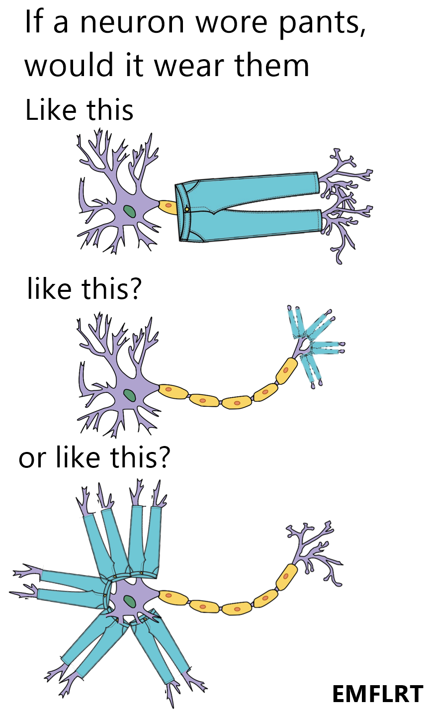


