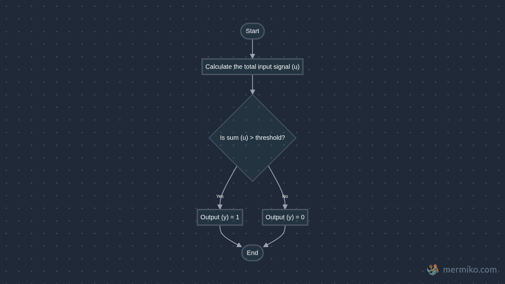

import Callout from '@/components/Callout.astro'

> [!NOTE]
> Once upon a time,
> **Neuroscientists**: "It’s all about synapses and neurotransmitters.”<br />
>
> **Engineers**: “Cool story. Let's make it run on Python?”

and here we are running LLMs...

I started reading this book "How Machines Learn", and was really fascinated and found myself deep into the rabbit hole. This blog post will explore how these first artificial neuron MCP followed by perceptron were modeled around the actual neuron. The math it uses is also pretty basic but amazing.

## The Real Deal: Biological Neurons

We all know Neurons are cells found in nevrous system and it's main job is to transmit electrical and chemical signals throughout the body.


### How do neurons work?

1. **Dendrites**: these are like thoundands of tiny antennas, each receive signals from other neurons

2. **Signals**: these are electrochemical signals and one thing to note is each signal has it's importance meaning one signal can be less important than other. Signals can be excitatory (encouraging the neuron to fire) or inhibitory (discouraging it)

3. **Cell body/Soma**: All the incoming signals gather up at the body and it decides whether to fire the signal or not. If the combines importance of the excitatory signal minus the inhibitroy signal exceeds this threshold -> Boom the neuron fires.

4. **Axon & Terminals**: This is like a dedicated output cable, carrying the decision. Axon terminals are like broadcast stations, sending the signal to dendrites of other neurons

### Neuron working analogy


Think of it like a bar with the world's most mathematical bouncer. Let's break down how this party (I mean, neuron ;) works:

1. Every person (signal) has a specific importance value (weight)
2. Normal people count as 1
3. VIPs count as 2 (they're twice as important!)
4. Police/party-poopers count as -2 (they actually work against the party starting)
5. The party only starts when the total "party value" hits a certain threshold

#### **The Basic Party Math**


When just one regular person shows up (value = 1), and the threshold is > 1, no party happens. But when two regular people arrive (1 + 1 = 2), boom! We hit the threshold, and the party (neuron) activates!

#### **When Things Get Interesting**


Now this is where our bouncer's math gets spicy (just like real-world drama):

**Scene 1**: Two regular college buddies show up $(1 + 1)$, but wait... who's that rolling up in a Mercedes? Oh snap, it's the minister's son and his influencial friend $(VIP = 2)$! Total party value hits $6$ and Party mode: ACTIVATED! 🎉

**Scene 2**: A police officer $(-2)$ shows up after getting noise complaints. But lucky for us, we've got our the minister's son and his equally influential friend $(2 + 2)$.
Even with Officer Party-Pooper, the vibe stays alive because $4 > threshold$.

Diplomatic immunity for the win! (He pulled off an _'Janta hai mera baap kon hai?'_)

**Scene 3**: Plot twist! Turns out he was just pretending to be a minister's son.

Three real police officers $(-2 × 3 = -6)$. Even with our regular squad and the influential friend $(total positive = 6)$, the party gets shut down faster than he can say "My dad will hear about this!" Because $6 - 6 = 0 < 4$

Moral of the story? Just like neurons, it's all about balance - and maybe don't lie about being a minister's kid! 😅

Just like this bouncer, a neuron:

- Adds up excitatory signals (party people)
- Subtracts inhibitory signals (police)
- Only "fires" (starts the party) when the total hits the threshold
- Stays quiet (no party) when it doesn't


Well that's what McCulloch Pitts Neuron (MCP) Neuron does. It's a super simplified binary version of a real neuron. Read more about the [limitations and differences](#limitations-and-differences) below.

## McCulloch Pitts Neuron (MCP)


Here is how it works:

1. Takes weighted inputs and sums them up
2. Passes weighted sum to the **activation function**
3. Activation function based on threshold produces binary output $1$ or $0$

> Why binary output?
>
> Because back then due to limited understanding of neurons, scientists were under the assumption that neurons were in two state: **Fires** or **Doesn't fire**.
>
> Now we know that Neurons produces spectrum of outputs and there are a lot more elements involved into it and we have more advanced models of neurons.

### Activation function

An activation function is like a decision-maker for a neuron, like the Soma (cell body).

It takes total signal a neuron receives (after adding all of the weighted inputs) and determines what the output should be, which is usually transformed into something useful like 0 or 1, or a number between 0 and 1.

The MCP neuron uses **Step Function** i.e it returns binary output based on the input meeting the given a threshold $θ(theta)$ criteria.

$y$ being the output of the activation function and $u$ being input (total signal/weighted sum) or in other terms $u$ is the output of the weighted sum function.

```math
{\displaystyle y={\begin{cases}1&{\text{if }}u\geq \theta \\0&{\text{if }}u<\theta \end{cases}}}
```

and if get anxious see such mathy fonts here is flow diagram:



This is also used in [perceptron](#perceptron) as we'll discuss further. But the question is what can we do with it?

### Logic Gates using MCP

Why are we suddenly talking about logic gates? Well, it turns out MCP neurons can do something pretty neat: they can simulate basic logical operations. This was one of the first practical applications that got researchers excited.

Just by choosing different weights and thresholds, we can make it perform logical operations. Let's see how:

#### The AND Gate

First, let's look at the AND operation:

| Input 1 | Input 2 | Output |
| ------- | ------- | ------ |
| 0       | 0       | 0      |
| 0       | 1       | 0      |
| 1       | 0       | 0      |
| 1       | 1       | 1      |

To make an MCP neuron behave like an AND gate:

- Give both inputs a weight of 1
- Set threshold to 2
- This way, we only get output 1 when BOTH inputs are 1 (1 + 1 ≥ 2)


#### The OR Gate

The OR operation outputs true if ANY input is true:

| Input 1 | Input 2 | Output |
| ------- | ------- | ------ |
| 0       | 0       | 0      |
| 0       | 1       | 1      |
| 1       | 0       | 1      |
| 1       | 1       | 1      |

To create an OR gate:

- Keep weights at 1 each
- Lower threshold to 1
- Now we get output 1 if ANY input is 1 (because 1 ≥ 1)


#### How would you implement NOT gate? (Inhibitor signal)

The NOT gate is particularly interesting because it mirrors how inhibitory signals work in biological neurons. Remember how our bouncer dealt with party-poopers? This is similar!

| Input | Output |
| ----- | ------ |
| 0     | 1      |
| 1     | 0      |

To create a NOT gate using an MCP neuron:

- Give the input a negative weight (-1): 👈 this makes it inhibitory
- Set threshold to 0
- When input is 1: (-1 × 1) = -1 < 0, output 0
- When input is 0: (-1 × 0) = 0 ≥ 0, output 1


<Callout variant="exercise" title="Try it yourself!">
- Try designing other logic gates (like <b>NAND</b>, <b>NOR</b>, <b>XOR</b>) using the MCP neuron model.
- Can you find a gate that <b>cannot</b> be implemented with a single MCP neuron? (Hint: **XOR**)
- Think about <b>why</b> some gates work and others don't, what's special about their logic?

</Callout>

### Threshold for biological neurons

<Callout variant="problem" title="Who decides the threshold?">
  Who sets the threshold in a neuron, and how does this work in biological
  neurons?
</Callout>

In biological neurons, the "threshold" is called **Action Potential** and it's determined by the neuron's properties and the environment.

The threshold can change based on chemicals in the brain, fatigue, or recent activity (for example, after firing a lot, a neuron might temporarily raise its threshold to avoid overloading).

So, in the brain, the threshold is a dynamic property, influenced by genetics, experience, and the neuron's current state.

### Limitations

Even though the MCP neuron was a breakthrough, it comes with some important limitations:

- **No learning or adaptation:** The weights are fixed and must be set manually, so the neuron can't adjust or improve itself based on experience or new data.
- **Works only with simple, linearly separable problems:** It can only handle binary (0/1) signals and can solve logic gates like AND, OR, and NOT, but fails for more complex cases like XOR that can't be separated by a straight line.

This made [Frank Rosenblatt](https://en.wikipedia.org/wiki/Frank_Rosenblatt) think: "How about making the MCP neuron learn?"

## Perceptron

The basic structure is just like the MCP neuron, but here's the big difference: **the weights can now be adjusted through learning!**

<Callout variant="explanation" title="What do we mean by learning?">
  **learning by error**: The perceptron tries to improve by looking at its
  mistakes. If it gets an answer wrong, it tweaks its weights a little to do
  better next time. Perceptron needs to be trained with lots of examples so it
  can adjust itself and make more accurate predictions.
</Callout>

Here's the simple but powerful learning rule:

<Callout variant="notation">
  $new\_weight = old\_weight + learning\_rate × (correct\_answer - prediction) ×
  input$
</Callout>

### Learning AND Gate

Instead of hardcoding weights like in MCP neuron, perceptron can learn the AND gate:

1. Start with random weights (maybe w1 = 0.3, w2 = 0.4)
2. Show it examples:
   ```
   Input: [1,1] → Should output: 1
   Input: [1,0] → Should output: 0
   Input: [0,1] → Should output: 0
   Input: [0,0] → Should output: 0
   ```
3. For each wrong prediction, adjust weights
4. Eventually, it finds weights that work (around w1 = 1, w2 = 1)

This ability to learn from examples was revolutionary! It meant we could train neural networks instead of having to figure out the exact weights ourselves.

